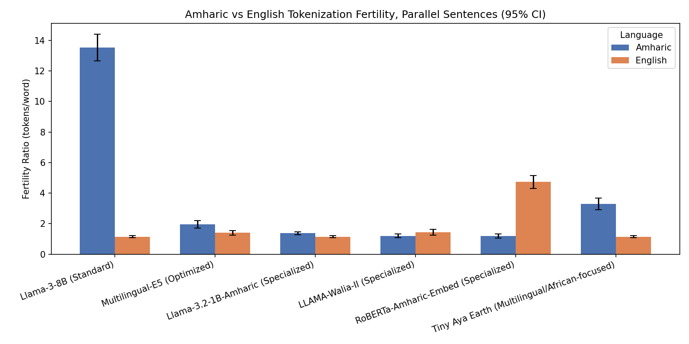

# Tokenization Analysis Benchmark for Low-Resource Languages (Amharic vs. English)

**Author:** Bedru Yimam Ahmed

Evaluates tokenization inefficiencies, subword fragmentation, fertility ratios,
and context-window exhaustion across standard, multilingual, and
Amharic-specialized LLM tokenizers, using 10 parallel Amharic/English
sentence pairs covering civic life, agriculture, health, education, and
infrastructure topics.

## Motivation

Tokenizers trained primarily on Latin-script, English-dominant corpora tend
to fragment morphologically rich, non-Latin-script languages like Amharic
(written in Ge'ez script) far more aggressively than English. This has
concrete downstream costs:

- **More tokens per sentence** → higher inference cost and latency for the
  same content.
- **Smaller effective context window** → less source text fits in a fixed
  token budget.
- **Worse subword semantics** → when a model falls back to byte-level
  tokens, it loses access to meaningful subword units, which can hurt
  downstream task performance.

This benchmark quantifies that gap directly, using **fertility ratio**
(tokens per word) and **characters per token (CPT)** as the core metrics,
computed on parallel Amharic/English sentences so the comparison is
apples-to-apples.

## Key findings

| Model/Tokenizer | Amharic fertility | English fertility | Gap ratio (AM/EN) |
|---|---|---|---|
| Llama-3-8B (Standard) | 13.524 | 1.148 | **11.78x** |
| GPT-4o (`tiktoken` `o200k_base`) | 9.978 | 1.148 | **8.69x** |
| Tiny Aya Earth (Multilingual/African-focused) | 3.291 | 1.148 | 2.87x |
| Multilingual-E5 / XLM-RoBERTa-base / AfroXLMR-large¹ | 1.951 | 1.399 | 1.40x |
| Llama-3.2-1B-Amharic (Specialized) | 1.375 | 1.148 | 1.20x |
| LLAMA-Walia-II (Specialized) | 1.200 | 1.435 | 0.84x |
| RoBERTa-Amharic-Embed (Specialized) | 1.199 | 4.733 | 0.25x |

¹ *Multilingual-E5, XLM-RoBERTa-base, and AfroXLMR-large all use the same
underlying XLM-R SentencePiece vocabulary and therefore produce identical
tokenization statistics — this is expected, not an error. AfroXLMR is
continually pretrained on African-language text but reuses the original
XLM-R tokenizer unchanged, so it improves the model's learned
representations of Amharic without changing tokenization efficiency at
all.*

**Headline result:** the standard Llama-3-8B tokenizer needs **~11.8x more
tokens per word** for Amharic than for equivalent English content, and its
characters-per-token collapses to ~0.4 — i.e. it spends *more than one
token per UTF-8 byte* of Amharic text, consistent with falling back to raw
byte-level tokens on Ge'ez script. GPT-4o's `o200k_base` tokenizer shows the
same failure mode at a smaller (but still severe) scale.

Two of the Amharic-"specialized" tokenizers (LLAMA-Walia-II,
RoBERTa-Amharic-Embed) actually invert the expected pattern and tokenize
Amharic *more* efficiently than English — a finding worth flagging on its
own, since it complicates the assumption that "specialized = balanced
across both languages" rather than "optimized primarily for one."



## Repository structure

```
.
├── README.md
├── LICENSE
├── requirements.txt
├── data/
│   └── parallel_pairs.json        # 10 parallel Amharic/English sentence pairs
├── notebooks/
│   └── tokenization_benchmark.ipynb  # main analysis notebook (recommended entry point)
├── src/
│   └── tokenization_benchmark.py     # equivalent standalone script
└── results/
    ├── fertility_comparison_amharic_vs_english.png
    └── fertility_gap_table.png
```

## Methodology

For each `(model, language)` pair, every sentence is tokenized and scored on:

- **Fertility ratio** = `token_count / word_count` (lower is more efficient)
- **Chars per token (CPT)** = `char_count / token_count` (higher is more efficient)

Both metrics are aggregated across the 10 sentences per language with a
**95% confidence interval** (via `scipy.stats.t`). Per-sentence tokenization
is also decoded back to human-readable form in **word-boundary runs**, not
token-by-token — this matters because byte-fallback tokenizers split
multi-byte Ge'ez characters (3 bytes each in UTF-8) across multiple tokens,
and a single such token cannot be decoded to valid UTF-8 in isolation.

Models covered:

| Category | Model |
|---|---|
| Standard (Latin-centric) | `meta-llama/Meta-Llama-3-8B`, GPT-4o (`tiktoken` `o200k_base`) |
| Multilingual baseline | `intfloat/multilingual-e5-large`, `FacebookAI/xlm-roberta-base` |
| African-focused | `Davlan/afro-xlmr-large`, `CohereLabs/tiny-aya-earth` |
| Amharic-specialized | `rasyosef/Llama-3.2-1B-Amharic-Instruct`, `israel/LLAMA-Walia-II`, `rasyosef/roberta-amharic-text-embedding-base` |

## Running it

```bash
pip install -r requirements.txt
jupyter notebook notebooks/tokenization_benchmark.ipynb
```

or, for the script version:

```bash
python src/tokenization_benchmark.py
```

Both regenerate the summary tables, the fertility-gap pivot table, and the
grouped bar chart from `data/parallel_pairs.json`.

Some models (e.g. `meta-llama/Meta-Llama-3-8B`) are gated on Hugging Face
and require `huggingface-cli login` with an account that has accepted the
model's license before `AutoTokenizer.from_pretrained(...)` will succeed.

## Limitations

- **Small sample size** (10 sentence pairs). Fertility CIs are wide for
  some models; 20-30+ pairs are needed for tighter estimates before
  drawing strong conclusions.
- **Single domain register**: sentences are formal/news-style civic
  language. Fertility may differ for conversational, technical, or
  dialectal Amharic text.
- **Translation direction**: English sentences were written to match the
  Amharic originals in meaning, not vice versa; phrasing choices in the
  English translations can shift token counts slightly.
- **Script-specific issues**: Ge'ez script has characters with no
  standalone Latin-keyboard equivalent, reduplication, and rich verb
  morphology that word-count-based fertility doesn't fully capture (e.g.
  a single Amharic word can be a full clause via affixation).

## Citation / attribution

If you use this benchmark or its parallel sentence set, please credit:

> Bedru Yimam Ahmed, *Tokenization Analysis Benchmark for Low-Resource
> Languages (Amharic vs. English)*, 2026.

## License

MIT — see [LICENSE](LICENSE).
"# Amharic-Tokenization-Benchmark" 
