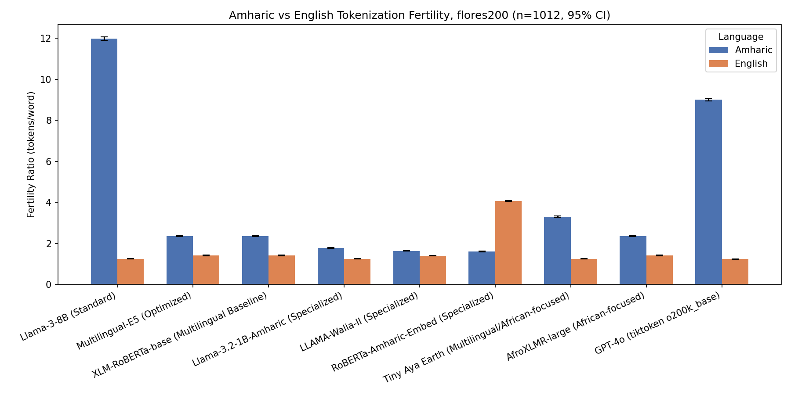

# Tokenization Analysis Benchmark for Low-Resource Languages (Amharic vs. English)

**Author:** Bedru Yimam Ahmed
**Email:** bedruy4@gmail.com

Evaluates tokenization inefficiencies, subword fragmentation, fertility ratios,
and context-window exhaustion across standard, multilingual, and
Amharic-specialized LLM tokenizers, using the **FLORES-200 `devtest` split
(1,012 professionally translated, fully parallel Amharic/English sentences)**.

## Motivation

Tokenizers trained primarily on Latin-script, English-dominant corpora tend
to fragment morphologically rich, non-Latin-script languages like Amharic
(written in Ge'ez script) far more aggressively than English. This has
concrete downstream costs:

- **More tokens per sentence** → higher inference cost and latency for the
  same content.
- **Smaller effective context window** → less source text fits in a fixed
  token budget.
- **Worse subword semantics** → when a model falls back to byte-level
  tokens, it loses access to meaningful subword units, which can hurt
  downstream task performance.

This benchmark quantifies that gap directly, using **fertility ratio**
(tokens per word), **characters per token (CPT)** and **tokens per UTF-8
byte** as the core metrics, computed on parallel Amharic/English sentences so
the comparison is like-for-like.

## Key findings

Corpus-level fertility (total tokens / total words) on FLORES-200 `devtest`
(n = 1,012 sentence pairs). The gap CI is a paired bootstrap over sentence
pairs (2,000 resamples).

| Model/Tokenizer | Amharic fertility | English fertility | Gap ratio (AM/EN) | Gap 95% CI |
|---|---|---|---|---|
| Llama-3-8B (Standard) | 11.894 | 1.241 | **9.59x** | [9.48, 9.70] |
| GPT-4o (`tiktoken` `o200k_base`) | 8.961 | 1.227 | **7.30x** | [7.23, 7.38] |
| Tiny Aya Earth (Multilingual/African-focused) | 3.266 | 1.239 | 2.64x | [2.61, 2.66] |
| Multilingual-E5 / XLM-RoBERTa-base / AfroXLMR-large¹ | 2.335 | 1.400 | 1.67x | [1.65, 1.69] |
| Llama-3.2-1B-Amharic (Specialized) | 1.751 | 1.241 | 1.41x | [1.40, 1.42] |
| LLAMA-Walia-II (Specialized) | 1.623 | 1.386 | 1.17x | [1.16, 1.18] |
| RoBERTa-Amharic-Embed (Specialized) | 1.594 | 4.039 | 0.40x | [0.39, 0.40] |

Characters per token (CPT), corpus level:

| Model/Tokenizer | CPT Amharic | CPT English |
|---|---|---|
| Llama-3-8B (Standard) | 0.423 | 4.857 |
| GPT-4o (`o200k_base`) | 0.561 | 4.911 |
| Tiny Aya Earth | 1.539 | 4.862 |
| Multilingual-E5 / XLM-RoBERTa-base / AfroXLMR-large¹ | 2.154 | 4.304 |
| Llama-3.2-1B-Amharic | 2.872 | 4.857 |
| LLAMA-Walia-II | 3.098 | 4.348 |
| RoBERTa-Amharic-Embed | 3.154 | 1.492 |

¹ *Multilingual-E5, XLM-RoBERTa-base, and AfroXLMR-large all use the same
underlying XLM-R SentencePiece vocabulary and therefore produce identical
tokenization statistics — this is expected, not an error. AfroXLMR is
continually pretrained on African-language text but reuses the original
XLM-R tokenizer unchanged, so it improves the model's learned
representations of Amharic without changing tokenization efficiency at
all.*

**Headline result:** the standard Llama-3-8B tokenizer needs **~9.6x more
tokens per word** for Amharic than for equivalent English content (95% CI
9.5–9.7), and its characters-per-token collapses to ~0.4. Its mean
tokens-per-byte on Amharic is 0.91 (vs 0.21 on English), i.e. it spends
**close to one token per UTF-8 byte** of Amharic text, consistent with
falling back to raw byte-level tokens on Ge'ez script. GPT-4o's `o200k_base`
tokenizer shows the same failure mode at a smaller (but still severe) scale.

**Specialization closes most, but not all, of the gap.** The best
Amharic-specialized tokenizers still need 1.17–1.41x more tokens per word
for Amharic than for English. They also differ in what they trade off:

- **Llama-3.2-1B-Amharic** keeps English tokenization identical to Llama-3
  (1.241) while cutting Amharic fertility from 11.9 to 1.75, so it improves
  Amharic without hurting English.
- **RoBERTa-Amharic-Embed** is the one tokenizer that inverts the expected
  pattern (0.40x): it tokenizes Amharic efficiently (1.59) but fragments
  English badly (4.04 tokens per word). This complicates the assumption that
  "specialized = balanced across both languages" rather than "optimized
  primarily for one."



*Error bars in the figure are sentence-level 95% t-intervals on the mean
per-sentence fertility, so the bar heights differ slightly from the
corpus-level numbers in the table above.*

### Earlier pilot run (10 hand-written pairs)

The first version of this benchmark used 10 hand-written sentence pairs and
reported a Llama-3-8B gap of 11.78x. That figure came from a very small,
hand-picked sample and is superseded by the FLORES-200 result above (9.59x).
The qualitative conclusions (standard tokenizers fail badly on Amharic;
specialized tokenizers help) held, but several numbers shifted, for example
LLAMA-Walia-II no longer tokenizes Amharic more efficiently than English.
The pilot pairs are still available in the notebook (`DATASET = "pilot"`).

## Repository structure

```
.
├── README.md
├── LICENSE
├── requirements.txt
├── notebooks/
│   └── tokenization_benchmark.ipynb   # main analysis notebook (entry point)
└── results/
    ├── fertility_comparison_amharic_vs_english.png
    ├── per_sentence_flores200_devtest.csv
    ├── summary_sentence_level_flores200_devtest.csv
    └── summary_corpus_level_flores200_devtest.csv
```

FLORES-200 itself is not stored in the repo. The notebook downloads it once
from Meta's official release and caches it in `./flores200`.

## Methodology

**Data.** The [FLORES-200](https://github.com/facebookresearch/flores/tree/main/flores200)
`devtest` split: sentence `i` in `amh_Ethi` is the professional translation of
sentence `i` in `eng_Latn` (1,012 pairs).

**Metrics.** For each `(model, language)` pair, every sentence is tokenized
and scored on:

- **Fertility ratio** = `token_count / word_count` (lower is more efficient;
  words are whitespace-separated)
- **Chars per token (CPT)** = `char_count / token_count` (higher is more efficient)
- **Tokens per byte** = `token_count / utf8_byte_count`

**Aggregation and uncertainty.**

- *Corpus level (headline numbers):* total tokens divided by total words (or
  characters) over all sentences. The Amharic/English gap and its 95% CI come
  from a **paired bootstrap over sentence pairs** (2,000 resamples, seed 0),
  so the two languages stay aligned in every resample.
- *Sentence level:* the mean of per-sentence metrics with a 95% t-interval
  (`scipy.stats.t`), saved in the summary CSV.

Per-sentence tokenization (first 20 pairs) is also decoded back to
human-readable form in **word-boundary runs**, not token-by-token. This
matters because byte-fallback tokenizers split multi-byte Ge'ez characters
(3 bytes each in UTF-8) across multiple tokens, and a single such token
cannot be decoded to valid UTF-8 in isolation.

Models covered:

| Category | Model |
|---|---|
| Standard (Latin-centric) | `meta-llama/Meta-Llama-3-8B`, GPT-4o (`tiktoken` `o200k_base`) |
| Multilingual baseline | `intfloat/multilingual-e5-large`, `FacebookAI/xlm-roberta-base` |
| African-focused | `Davlan/afro-xlmr-large`, `CohereLabs/tiny-aya-earth` |
| Amharic-specialized | `rasyosef/Llama-3.2-1B-Amharic-Instruct`, `israel/LLAMA-Walia-II`, `rasyosef/roberta-amharic-text-embedding-base` |

## Running it

```bash
pip install -r requirements.txt
jupyter notebook notebooks/tokenization_benchmark.ipynb
```

Configuration options at the top of the notebook:

| Setting | Default | Meaning |
|---|---|---|
| `DATASET` | `"flores200"` | `"flores200"` or `"pilot"` (original 10 hand-written pairs) |
| `FLORES_SPLIT` | `"devtest"` | `"devtest"` (1,012 sentences) or `"dev"` (997) |
| `N_SENTENCES` | `None` | `None` for all sentences, or e.g. `200` for a quick test run |
| `N_BOOT` | `2000` | Bootstrap resamples for corpus-level CIs |

The notebook regenerates the summary tables, the corpus-level gap table, the
grouped bar chart, and the CSV files in `results/`.

Some models (e.g. `meta-llama/Meta-Llama-3-8B`) are gated on Hugging Face
and require `huggingface-cli login` with an account that has accepted the
model's license before `AutoTokenizer.from_pretrained(...)` will succeed.

## Limitations

- **Fertility measures efficiency, not model quality.** A lower fertility
  means shorter sequences and lower cost, but this benchmark does not show
  that a tokenizer leads to better downstream accuracy.
- **Whitespace word counts.** Fertility divides by whitespace-separated words.
  Amharic words often carry affixes that correspond to several English words
  (a single Amharic word can be a full clause), so words are not strictly
  comparable across the two languages. CPT and tokens per byte are included
  partly to avoid this issue.
- **Domain and register.** FLORES-200 is drawn from Wikinews, Wikijunior and
  Wikivoyage, so it covers news, educational and travel text. Fertility may
  differ for conversational, technical, social-media, or dialectal Amharic.
- **Translation direction.** FLORES English sentences were the source and the
  Amharic sentences are translations, so phrasing choices in the Amharic
  translations can shift word and token counts slightly.
- **Tokenizer only.** Models that share a tokenizer (e.g. XLM-R, E5,
  AfroXLMR) are indistinguishable here even though the models themselves
  differ in how well they handle Amharic.
- **Script-specific issues.** Ge'ez script has reduplication and rich verb
  morphology that word-count-based fertility does not fully capture.

## Citation / attribution

If you use this benchmark, please credit:

> Bedru Yimam Ahmed, *Tokenization Analysis Benchmark for Low-Resource
> Languages (Amharic vs. English)*, 2026.

Please also cite FLORES-200 (NLLB Team et al., 2022, "No Language Left
Behind: Scaling Human-Centered Machine Translation") when using its sentences.

## License

MIT — see [LICENSE](LICENSE).
